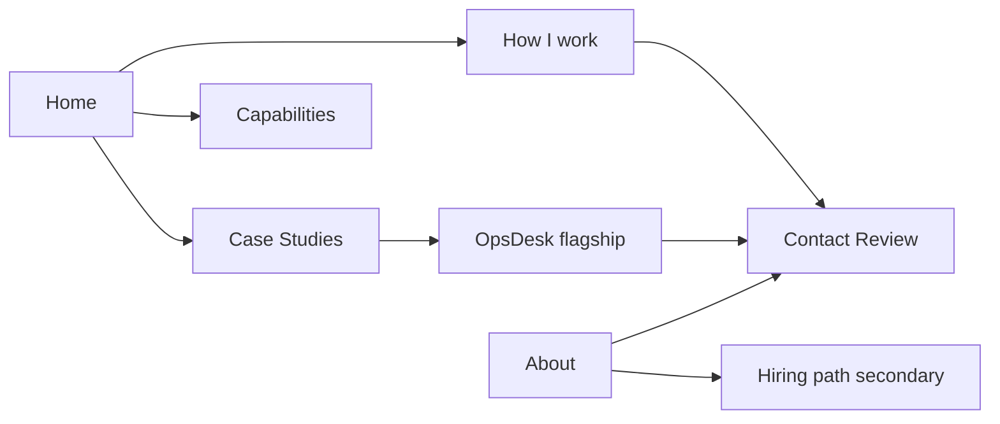

# Client-facing website redesign

> Implementation plan for evolving michaeljlow.com from portfolio/job-seeking to a client-facing Applied AI Systems practice.
>
> Commercial truth: `../Applied AI Consultancy/offers-and-pricing.md` and `../Applied AI Consultancy/website-strategy.md`
>
> Cursor plan mirror (optional): `~/.cursor/plans/client-facing_site_redesign_fd427b1d.plan.md`

## Defaults locked

- **Visual approach:** Evolve the current linen/paper homepage language (IBM Plex, calm boutique). Do **not** invent a new brand palette. Unify About / Contact / Work / Projects under that same system so the site stops feeling like two themes.
- **Primary commercial CTA everywhere:** **Start with a Workflow Review** (not Audit). Audit stays on the How I work ladder as the deeper discovery tier.
- **Contact:** Email-first Review enquiry (`mailto` with a clear subject and prefilled qualification prompts). No form or Calendly in v1.
- **Public brand:** Use **Michael J. Low · Applied AI Systems** consistently in page titles and primary brand copy (two lines is fine; do not use an em dash). Keep truthful personal/location detail on About; do not imply a local office or client history that does not exist.
- **Copy rule:** **No em dashes (—) anywhere on the public site**, including brand lines, headings, body copy, CTAs, metadata, and case studies. Use commas, full stops, colons, parentheses, line breaks, or middle dots (·) instead. Grep for `—` before launch.
- **Measurement:** **Vercel Web Analytics** for traffic, page views, referrers and navigation (cookie-free). Ask “How did you find me?” in the prefilled enquiry body; record lead source and conversion manually in HubSpot. No GA4, Clarity, or heatmaps in v1. Custom CTA events deferred until Pro analytics if needed.
- **Implementation model:** Prefer **Claude Opus 5 Thinking (high)** for the redesign build. Fallback: **Claude Sonnet 5 Thinking (high)**.



---

## Phase 0 — Quick CTA alignment

| Location | Change |
|---|---|
| `src/content/projects/opsdesk-ai.mdx` | `Start with a workflow audit` → `Start with a Workflow Review` |
| `src/config/site.ts` | `homeHelpCta`, contact labels, any “workflow audit” primary CTA → Review |
| Navbar availability pill | Client-facing availability (projects / Reviews), drop “roles” from the pill |

---

## Phase 1 — Source of truth in `site.ts`

Rewrite `src/config/site.ts` so live pages read from one config:

- Brand: **Michael J. Low / Applied AI Systems**
- `availability`: selected workflow projects / Reviews — **remove embedded remote roles**
- Replace `homeHelpAreas` / `workPage.offerings` with the real ladder:

**Discovery:** Review from £350 · Audit from £950  
**Implementation:** Starter from £750 · Connected from £1,800 · Controlled Pilot from £4,500

- Short includes / “best for” blurbs from offers-and-pricing (not a SaaS comparison table)
- Supporting line: starting points; final quote after Review or Audit; tools usually client-owned
- Credit line: Review → Audit within 30 days
- `homeFeaturedProjectSlugs`: **OpsDesk first**; secondary = AI Daily Pulse and Macro Signal Room. Demote SENTINEL / Libertrade LOOP off the homepage (remain on Case Studies index)
- Wire `nav` to match real Navbar

Keep hourly rates and support retainers **out** of public config.

---

## Phase 2 — Information architecture & nav

Update `src/components/Navbar.astro` and `src/components/Footer.astro`:

| Label | Target |
|---|---|
| Home | `/` |
| How I work | `/how-i-work` (new page; redirect `/work` → `/how-i-work`) |
| Case Studies | `/projects` (UI label only; keep `/projects/...` URLs for now) |
| Capabilities | `/capabilities` |
| About | `/about` |
| Contact | `/contact` |

Retire nav labels: “Systems” as the primary story, “Available for … roles”.

Lab routes (`*-lab.astro`): exclude from sitemap + `noindex`.

---

## Phase 3 — Homepage (`src/pages/index.astro`)

One composition in the first viewport:

1. **Hero:** brand + line (“messy operations → dependable AI systems”) + short support sentence  
   - Primary CTA → Contact / Review  
   - Secondary CTA → Case Studies / OpsDesk  
2. **Selected case studies:** OpsDesk featured; 1–2 supporting max  
3. **Working with me:** Discovery + Implementation ladder with “from” prices  
4. **Who this is for:** shared inbox / spreadsheets / CRM; repeated admin  
5. **Contact strip:** Review enquiry — **not** “open to engineering roles”

Remove the skills-as-CV grid from the homepage. **Remove the full About + portrait block from Home** (currently `#about` with headshot and capability columns). Home stays commercial: hero, proof, offers, who this is for, contact. Do not merge About into Contact or How I work.

Optional on Home only: a single compact founder line with link to `/about` (e.g. “Michael J. Low builds applied AI systems for operations teams. About →”). No duplicate portrait on Home unless you later add a small avatar in the footer.

Keep Observe→Simplify→Build→Iterate as a compact process strip. Preserve linen/paper aesthetic.

---

## Phase 4 — How I work page

Create `src/pages/how-i-work.astro`:

- Review vs Audit (depth, not company size)
- Starter / Connected / Pilot boundaries
- Credits between tiers
- Path diagram: discovery scopes work; implementation price depends on scope
- What you get / what stays human-controlled
- Starting-price and client-owned tool-cost disclaimer
- CTA → Contact for a Review

Redirect `/work` → `/how-i-work`.

---

## Phase 5 — Contact & About

**Contact** (`src/pages/contact.astro`):

- Lead with Workflow Review from £350
- Mailto subject `Workflow Review enquiry` + prefilled body (business, workflow, tools, volume, referral source)
- Drop roles-first framing
- No portrait here; Contact is action-only

**About** (`src/pages/about.astro` + `about` in site.ts):

- **Stays its own page at `/about` in main nav.** Not combined with Contact, Home, or How I work.
- **Keep the portrait/headshot.** For a one-person consultancy it builds trust; clients buy you, not a logo.
- Restructure content for client-first story:
  - Photo + short intro (how you help businesses with messy ops)
  - How you work with clients (observe, simplify, build, hand over)
  - Principles / traits (practical, human-in-the-loop, honest about limits)
  - Optional personal line (location, human detail)
  - **Secondary block at bottom:** “Bring me into your team” for hiring managers (email/LinkedIn)
- Remove “Open to AI product & systems roles” from primary meta and hero area on About
- Retire homepage `#about` anchor from nav; Navbar “About” goes to `/about` only

---

## Phase 6 — Case Studies index & OpsDesk

- `src/pages/projects/index.astro`: retitle UI to **Case Studies**; OpsDesk featured
- OpsDesk CTA: Workflow Review; preserve prototype / synthetic data labels
- Loom: out of scope

No bulk rewrite of every MDX case study in v1.

---

## Phase 7 — Capabilities

Create `src/pages/capabilities.astro`:

- Workflow intake, routing, approval and audit — OpsDesk prototype
- AI workflow evaluation — labelled synthetic/practice evidence
- Workflow automation / connected tools — Starter / Connected
- Planned capabilities only in a “developing from client demand” section

Close with Review CTA. Not a tech CV.

---

## Phase 8 — Vercel Web Analytics

1. Enable Web Analytics in the Vercel project dashboard (manual once).
2. `npm install @vercel/analytics`
3. Add to `src/components/Layout.astro`:

```astro
---
import Analytics from '@vercel/analytics/astro';
---
<!-- in <head> -->
<Analytics mode="production" />
```

4. Privacy page: cookie-free / anonymised aggregates; HubSpot/email separate.
5. No GA4, Clarity, heatmaps, or paid custom events in v1.

---

## Phase 9 — Trust, discoverability & doc sync

- Grep: `roles`, `workflow audit` as primary CTA, `hire me`, stale `/#help`, and em dashes (`—`)
- Metadata + truthful structured data (no invented address/ratings/client history)
- `/privacy` + footer link
- Sitemap: exclude labs, 404, redirects; `noindex` labs
- Sync Applied AI Consultancy README / 90-day-plan / website-strategy when shipped

---

## Phase 10 — Verification & launch

- `npm run build` clean
- All primary CTAs + `/work` redirect work
- Analytics enabled and receiving page views after deploy
- Mobile + keyboard QA on primary routes
- Prices match offers-and-pricing.md
- Prototype claims remain accurate

### Launch acceptance

1. Visitor can identify the £350 first step within one screen.
2. Review vs Audit and build tiers are clear without a call.
3. Every commercial path ends at a Review enquiry.
4. OpsDesk is primary proof and does not overclaim production use.
5. Hiring language is About-only secondary.
6. One coherent visual system on mobile/keyboard.
7. Production traffic appears in Vercel Web Analytics.
8. No em dashes (`—`) in published copy or metadata.

---

## Page roles (quick reference)

| Page | Job | Portrait? |
|---|---|---|
| **Home** | Offer, proof, pricing ladder, Review CTA | No full portrait (optional text link to About) |
| **How I work** | Discovery + implementation detail | No |
| **Case Studies** | OpsDesk-led proof | No |
| **Capabilities** | What you can assemble | No |
| **About** | Founder trust, how you work, hiring secondary | **Yes, keep photo** |
| **Contact** | Review enquiry | No |

---

## Build order

1. Phase 0 CTA + `site.ts` offer ladder  
2. Nav + How I work + `/work` redirect  
3. Homepage restructure  
4. Contact + About  
5. Case Studies index + featured slugs  
6. Capabilities + Vercel Analytics + privacy/metadata  
7. Build + QA + deploy  

**Out of scope:** company rename, blog rebuild, support-plan pricing tables, Loom, new portfolio projects, full visual rebrand, GA4/Clarity.
